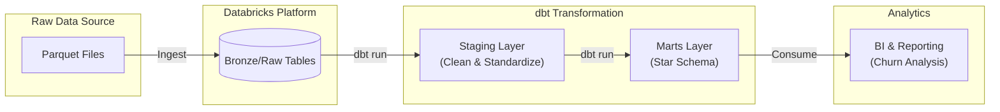

# Telecom Churn Analysis with dbt & Databricks

## 📌 Project Overview
This project implements a robust data transformation pipeline using **dbt (data build tool)** and **Databricks**. It processes raw telecom customer data to analyze churn patterns, customer demographics, and revenue metrics. The pipeline transforms raw data into a structured **Star Schema** optimized for business intelligence and reporting.

## ✅ Project Status
**Status**: Completed
- **Data Pipeline**: Fully functional from Staging to Marts.
- **Data Quality**: Comprehensive tests (unique, not_null, relationships) implemented.
- **Modeling**: Star Schema architecture successfully deployed.

## 🏗 Architecture
The project follows a layered modeling approach:

### 1. Staging Layer (`models/staging`)
- **`stg_telecom_churn`**: Cleans and standardizes raw data from Databricks.
  - Renames columns to snake_case.
  - Casts data types (Boolean, Integer, Decimal).
  - Handles null values and standardizes categorical fields.

### 2. Marts Layer (`models/mart`) - Star Schema
The data is modeled into a central Fact table surrounded by Dimensions:

- **Fact Table**:
  - **`fct_churn_metrics`**: Contains quantitative metrics (Revenue, Charges) and foreign keys to dimensions.

- **Dimension Tables**:
  - **`dim_customers`**: Customer demographics (Age, Gender, Partner, Dependents).
  - **`dim_locations`**: Geographic data (City, State, Zip Code).
  - **`dim_contracts`**: Contract details, Payment methods, and Billing info.
  - **`dim_service_features`**: Service subscriptions (Streaming, Security, Backup).
  - **`dim_churn_details`**: Churn status, reasons, and categories (Junk Dimension).

## 🔄 Project Flow


## 🚀 Getting Started

### Prerequisites
- dbt Core installed
- Access to a Databricks cluster
- `profiles.yml` configured for `telecom_churn_databricks`

### Running the Project
1. **Install Dependencies**:
   ```bash
   dbt deps
   ```

2. **Seed Data** (if applicable):
   ```bash
   dbt seed
   ```

3. **Run Models**:
   ```bash
   dbt run
   ```

4. **Test Data Quality**:
   ```bash
   dbt test
   ```

5. **Generate Documentation**:
   ```bash
   dbt docs generate
   dbt docs serve
   ```

## 📊 Key Metrics & Insights
The modeled data enables analysis of:
- **Churn Rate**: By demographics, contract type, and geography.
- **Revenue Analysis**: Monthly charges, total revenue, and CLTV (Customer Lifetime Value).
- **Service Usage**: Adoption of internet services, streaming, and tech support.

## 📂 Project Structure
```
telecom_churn_databricks/
├── models/
│   ├── staging/            # Raw data cleaning and standardization
│   └── mart/               # Dimensional modeling (Star Schema)
├── tests/                  # Data quality tests
├── seeds/                  # Reference data
├── analyses/               # Ad-hoc queries
└── dbt_project.yml         # Project configuration
```

## 🛠 Tools Stack

| Category | Tool | Description |
|----------|------|-------------|
| **Transformation** |  | Data transformation and modeling (dbt Core) |
| **Platform** |  | Unified data analytics platform for compute and storage |
| **Languages** |   | SQL for transformations, Jinja for templating |
| **Utilities** | `dbt-utils` | Common dbt macros and utilities |
| **Version Control** |  | Source code management |
| **Data Format** | Parquet | Columnar storage format for raw data |
